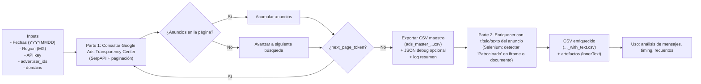
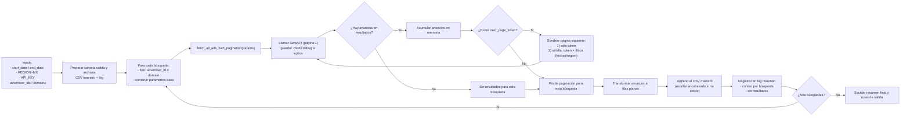

```mermaid
flowchart LR
  %% Pipeline general: Ads Transparency Center (Google) + Enriquecimiento
  A["Inputs<br/>- Fechas (YYYYMMDD)<br/>- Región (MX)<br/>- API key<br/>- advertiser_ids<br/>- domains"] --> B["Parte 1: Consultar Google Ads Transparency Center<br/>(SerpAPI + paginación)"]
  B --> C{"¿Anuncios en la página?"}
  C -- "Sí" --> D["Acumular anuncios"]
  C -- "No" --> E["Avanzar a siguiente búsqueda"]
  D --> F{"¿next_page_token?"}
  F -- "Sí" --> B
  F -- "No" --> G["Exportar CSV maestro<br/>(ads_master_...csv)<br/>+ JSON debug opcional<br/>+ log resumen"]
  E --> F
  G --> H["Parte 2: Enriquecer con título/texto del anuncio<br/>(Selenium: detectar 'Patrocinado' en iframe o documento)"]
  H --> I["CSV enriquecido<br/>(..._with_text.csv)<br/>+ artefactos (innerText)"]
  I --> J["Uso: análisis de mensajes, timing, recuentos"]
```

```mermaid
flowchart LR
  %% Parte 1 — Búsqueda en Google Ads Transparency Center (SerpAPI)
  A["Inputs<br/>- start_date / end_date<br/>- REGION=MX<br/>- API_KEY<br/>- advertiser_ids / domains"] --> B["Preparar carpeta salida y archivos<br/>CSV maestro + log"]
  B --> C["Para cada búsqueda:<br/>- tipo: advertiser_id o domain<br/>- construir parámetros base"]
  C --> D["fetch_all_ads_with_pagination(params)"]
  D --> E["Llamar SerpAPI (página 1)<br/>guardar JSON debug si aplica"]
  E --> F{"¿Hay anuncios en resultados?"}
  F -- "Sí" --> G["Acumular anuncios en memoria"]
  F -- "No" --> H["Sin resultados para esta búsqueda"]
  G --> I{"¿Existe next_page_token?"}
  I -- "Sí" --> J["Sondear página siguiente:<br/>1) sólo token<br/>2) si falla, token + filtros (fechas/region)"]
  J --> E
  I -- "No" --> K["Fin de paginación para esta búsqueda"]
  H --> K
  K --> L["Transformar anuncios a filas planas"]
  L --> M["Append al CSV maestro<br/>(escribe encabezado si no existe)"]
  M --> N["Registrar en log resumen<br/>- conteo por búsqueda<br/>- sin resultados"]
  N --> O{"¿Más búsquedas?"}
  O -- "Sí" --> C
  O -- "No" --> P["Escribir resumen final y rutas de salida"]
```

```mermaid
flowchart LR
  %% Parte 2 — Enriquecimiento por iframe/“Patrocinado” (Selenium)
  A["Input: CSV maestro<br/>ads_master_YYYYMMDD_YYYYMMDD.csv"] --> B["Validar columnas y preparar salida<br/>..._with_text.csv + carpetas artefactos"]
  B --> C["Inicializar Chrome (webdriver-manager)<br/>idioma ES y logs limpios"]
  C --> D["Iterar filas con 'details_link'"]
  D --> E["Abrir URL del anuncio"]
  E --> F["Polling rápido (≤15s):<br/>buscar anchor 'Patrocinado / Sponsored'<br/>en iframes o documento"]
  F --> G{"¿Anchor detectado a tiempo?"}
  G -- "Sí" --> H["Usar innerText detectado (contexto cacheado)<br/>Extraer Título + Descripción"]
  G -- "No" --> I["Fallback estable:<br/>1) Recorrer iframes y buscar anchor<br/>2) Si no, documento: primeras líneas 'buenas'"]
  H --> J["Guardar artefactos (innerText)<br/>y escribir columnas:<br/>ad_title, ad_text, where, source_detail, snippet"]
  I --> J
  J --> K{"¿Cada N filas (auto-save)?"}
  K -- "Sí" --> L["Guardar ..._with_text.csv"]
  K -- "No" --> M["Continuar con siguiente fila"]
  L --> M
  M --> N{"¿Más filas?"}
  N -- "Sí" --> D
  N -- "No" --> O["Cerrar driver, guardar CSV final y métricas:<br/>OK iframe / OK inner / Fallback / Vacíos"]
```
