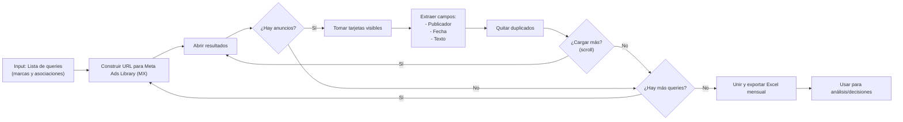

```mermaid
flowchart LR
  A["Input: Lista de queries<br/>(marcas y asociaciones)"] --> B["Construir URL para Meta Ads Library (MX)"]
  B --> C["Abrir resultados"]
  C --> D{"¿Hay anuncios?"}
  D -- "Sí" --> E["Tomar tarjetas visibles"]
  E --> F["Extraer campos:<br/>- Publicador<br/>- Fecha<br/>- Texto"]
  F --> G["Quitar duplicados"]
  G --> H{"¿Cargar más? <br/>(scroll)"}
  H -- "Sí" --> C
  H -- "No" --> I{"¿Hay más queries?"}
  D -- "No" --> I
  I -- "Sí" --> B
  I -- "No" --> J["Unir y exportar Excel mensual"]
  J --> K["Usar para análisis/decisiones"]
```
