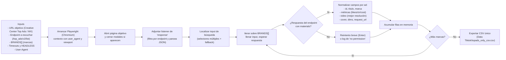
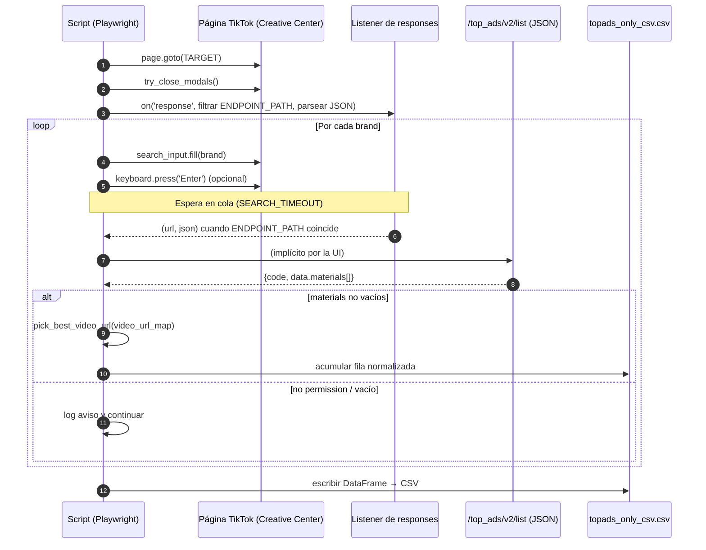

```mermaid
flowchart LR
  %% Contexto — TikTok Top Ads a CSV
  A["Inputs<br/>- URL objetivo (Creative Center Top Ads / MX)<br/>- Endpoint a escuchar (/top_ads/v2/list)<br/>- BRANDS[] (marcas)<br/>- Timeouts y HEADLESS<br/>- User-Agent"] --> B["Arrancar Playwright (Chromium)<br/>contexto con user_agent y viewport"]
  B --> C["Abrir página objetivo<br/>y cerrar modales si aparecen"]
  C --> D["Adjuntar listener de 'response'<br/>(filtra por endpoint y parsea JSON)"]
  D --> E["Localizar input de búsqueda<br/>(selectores múltiples + fallback)"]
  E --> F["Iterar sobre BRANDS[]<br/>llenar input, esperar respuesta"]
  F --> G{"¿Respuesta del endpoint<br/>con materials?"}
  G -- "Sí" --> H["Normalizar campos por ad:<br/>- id, título, marca<br/>- métricas (likes/ctr/cost)<br/>- video (mejor resolución)<br/>- cover, dims, request_url"]
  G -- "No" --> I["Reintento breve (Enter)<br/>o log de 'no permission'"]
  H --> J["Acumular filas en memoria"]
  I --> J
  J --> K{"¿Más marcas?"}
  K -- "Sí" --> F
  K -- "No" --> L["Exportar CSV único<br/>(Data Tiktok/topads_only_csv.csv)"]
```

```mermaid
flowchart LR
  %% Flujo detallado — por marca
  S0["Inicializar:<br/>browser/context/page<br/>listener de responses (cola)"] --> S1["Localizar input de búsqueda<br/>(varios selectores + fallback)"]
  S1 --> S2["Para cada brand en BRANDS[]"]
  S2 --> S3["Limpiar input y escribir 'brand'<br/>+ pequeño delay"]
  S3 --> S4["Opcional: presionar Enter"]
  S4 --> S5["Esperar en cola de responses<br/>(SEARCH_TIMEOUT)"]
  S5 --> S6{"¿Hay responses<br/>con keyword=brand?"}
  S6 -- "Sí" --> S7["Procesar JSON:<br/>data.materials[]"]
  S6 -- "No" --> S8["Reintentar (Enter)<br/>y esperar de nuevo"]
  S8 --> S6
  S7 --> S9{"¿materials no vacío?"}
  S9 -- "Sí" --> S10["Elegir video_best por resolución<br/>(pick_best_video_url)"]
  S10 --> S11["Crear fila normalizada:<br/>brand_query, ad_id, ad_title,<br/>brand_name, likes, ctr, cost,<br/>duration, width, height,<br/>video_best, cover, raw_code/msg,<br/>request_url"]
  S11 --> S12["Agregar a rows[]"]
  S9 -- "No" --> S13["Log: sin materials (p.ej. code=40101)"]
  S12 --> S14{"¿Siguiente brand?"}
  S13 --> S14
  S14 -- "Sí" --> S2
  S14 -- "No" --> S15["Cerrar navegador y<br/>construir DataFrame(rows)"]
  S15 --> S16{"¿rows > 0?"}
  S16 -- "Sí" --> S17["Reordenar columnas y<br/>guardar CSV (utf-8-sig)"]
  S16 -- "No" --> S18["Advertir: no se extrajeron filas<br/>revisar permisos o HEADLESS=False"]
```

```mermaid
sequenceDiagram
  autonumber
  participant App as Script (Playwright)
  participant PG as Página TikTok (Creative Center)
  participant Net as Listener de responses
  participant API as /top_ads/v2/list (JSON)
  participant CSV as topads_only_csv.csv

  App->>PG: page.goto(TARGET)
  App->>PG: try_close_modals()
  App->>Net: on('response', filtrar ENDPOINT_PATH, parsear JSON)
  loop Por cada brand
    App->>PG: search_input.fill(brand)
    App->>PG: keyboard.press('Enter') (opcional)
    Note over App,Net: Espera en cola (SEARCH_TIMEOUT)
    Net-->>App: (url, json) cuando ENDPOINT_PATH coincide
    App->>API: (implícito por la UI)
    API-->>App: {code, data.materials[]}
    alt materials no vacíos
      App->>App: pick_best_video_url(video_url_map)
      App->>CSV: acumular fila normalizada
    else no permission / vacío
      App->>App: log aviso y continuar
    end
  end
  App->>CSV: escribir DataFrame → CSV
```
